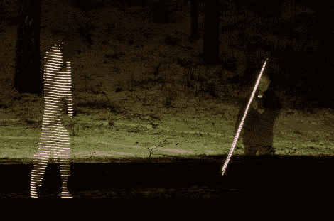

# 画你的画，不需要电脑

> 原文：<https://hackaday.com/2012/01/30/paint-your-pictures-no-pc-needed/>

发光二极管和照相机总是一个有趣的组合，也很容易获得乐趣。[光绘棒](http://www.guzzzt.com/stuff/light_painting_stick_1.shtml)类似于其他[长曝光相机特技](http://hackaday.com/2011/03/02/how-to-find-wifi-carry-a-big-stick-and-use-long-exposures/)如[光绘棒](http://hackaday.com/2011/06/28/giant-pov-tube-for-light-painting/)并得到大致相同的结果。不同的是，光绘棒是独立的，这意味着你不必拖着那么多东西去玩。

使用的硬件是 HL1606 控制的 RGB led 灯条，通常在 [Adafruit](http://www.adafruit.com/products/306) 可以找到，大脑是一个 [Leaf Labs](http://leaflabs.com/) Maple 微控制器板，附带 SD 卡和一些人机界面，由 6 伏灯笼电池供电。

图像是 64*infinity 24 位 BMP 文件，这意味着除了做一个简单的旋转，没有太多的麻烦来准备你的图形。您可以使用双向开关和控制杆上的 led 来选择显示哪个图像。选择您的图像，用电位计拨入您的速度，然后您就可以按下拍摄按钮享受拍照乐趣了。