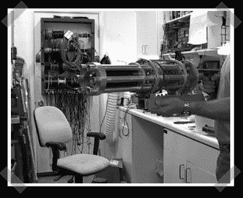

# 彩弹迷你枪

> 原文：<https://hackaday.com/2006/11/17/paintball-minigun/>

所以我经常谷歌我的[彩弹迷你枪](http://www.google.com/search?q=paintball+minigun)。这一次，它实际上发现了一些好东西。特效制作人[瑞克·加林森](http://www.imdb.com/name/nm0302218/)一直在制作一个……等等……[彩弹迷你枪](http://www.remotelyinteresting.com/paintball%20minigun%20page.html) ( [缓存](http://www.remotelyinteresting.com.nyud.net:8090/paintball%20minigun%20page.html))。他的网站上有一段演习视频。很明显他的引爆器有问题。我只想知道他打算怎么装货。

Rick 还有很多其他很酷的项目。他有一个很酷的[双臂迷你枪道具](http://www.remotelyinteresting.com/zombie%20minigun%20page.htm) ( [缓存](http://www.remotelyinteresting.com.nyud.net:8090/zombie%20minigun%20page.htm))(看起来像[莫涅夫 the Gale](http://en.wikipedia.org/wiki/Gung-Ho_Guns#Monev_the_Gale) )，一个遥控[潜艇](http://www.remotelyinteresting.com/submarine%20page.html) ( [缓存](http://www.remotelyinteresting.com.nyud.net:8090/submarine%20page.html))，还有一套非常酷的[遥测服](http://www.remotelyinteresting.com/telemetry%20suit%20page.htm) ( [缓存](http://www.remotelyinteresting.com.nyud.net:8090/telemetry%20suit%20page.htm))用于收集上身运动数据。

为了完整起见，您可以查看蒙蒂的迷你枪，了解其他[彩弹迷你枪](http://www.montysminiguns.com/paintball.htm)和一般迷你枪的信息。

*   [永久链接](http://www.remotelyinteresting.com/paintball%20minigun%20page.html)