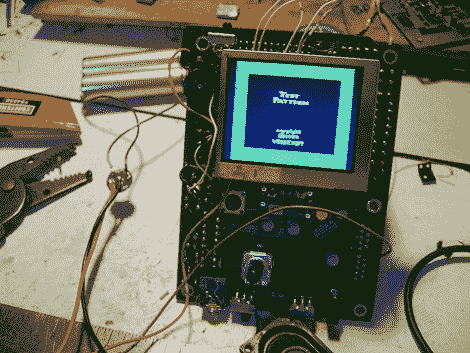

# 手掌大小的雅达利 2600

> 原文：<https://hackaday.com/2010/01/26/palm-sized-atari-2600/>

[长角牛工程师]正在研制便携式 Atari 2600。他没有把旧的游戏系统塞进便携式设备中，而是在一个新的硬件项目中设计了自己的电路板，他称之为 Project Unity。这款掌上电脑将包含你需要的一切，包括视频、音频、控制器按钮、手柄控制和一个盒式磁带连接器。对于在休息后嵌入的演示，他使用 [Harmony Cartridge](http://harmony.atariage.com/) 来存储他的 Atari ROMs，但请注意，该系统是为使用 Cartridge 而设计的，而不是仅仅作为[游戏点唱机](http://hackaday.com/2009/12/16/2600-game-jukebox/)。

[https://www.youtube.com/embed/xOqpHkKknq0?version=3&rel=1&showsearch=0&showinfo=1&iv_load_policy=1&fs=1&hl=en-US&autohide=2&wmode=transparent](https://www.youtube.com/embed/xOqpHkKknq0?version=3&rel=1&showsearch=0&showinfo=1&iv_load_policy=1&fs=1&hl=en-US&autohide=2&wmode=transparent)