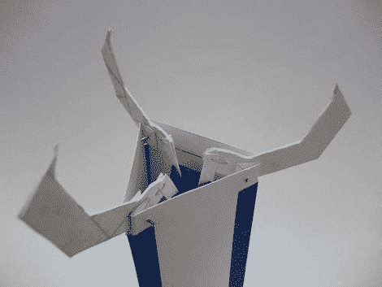

# 纸制工艺爪

> 原文：<https://hackaday.com/2011/07/05/paper-craft-claw/>

拿一些硬纸，开始制作你自己的纸爪。[Dombeef]贴出了重新制作上述爪子的说明，因为他对自己以前的设计不满意，因为他以前的设计很脆弱，无法捡起任何东西。这个版本稍微大一点，它把所有的部分都内化了。

作为纸工艺品，你不需要太多的材料或工具。一个图钉为作为支点的回形针和金属丝打孔。胶水和一些胶带将组件的其余部分粘在一起。休息之后你可以看到最终产品的视频。中间的轴在拉动时关闭爪，在向相反方向推动时打开爪。这使得它非常适合那个[自制的起重机游戏](http://hackaday.com/2010/08/16/home-claw-game-delights-the-little-ones/)(或者那个[是一个爪形游戏](http://hackaday.com/2010/08/16/home-claw-game-delights-the-little-ones/)？)…只要你不想拿太重的东西。

[https://www.youtube.com/embed/d_zpLkn6-rE?version=3&rel=1&showsearch=0&showinfo=1&iv_load_policy=1&fs=1&hl=en-US&autohide=2&wmode=transparent](https://www.youtube.com/embed/d_zpLkn6-rE?version=3&rel=1&showsearch=0&showinfo=1&iv_load_policy=1&fs=1&hl=en-US&autohide=2&wmode=transparent)