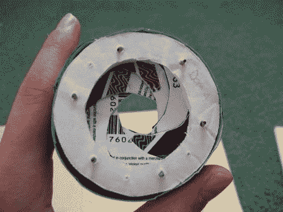

# 纸质机械虹膜

> 原文：<https://hackaday.com/2011/03/22/paper-mechanical-iris/>

这个起作用的[机械 irs](http://www.instructables.com/id/Paper-Mechanical-Iris/) 由纸质模板、泡沫芯海报板、旧的信用卡/礼品卡/ etc 卡、回形针和胶带制成。首先，设计好图案，打印出多个图案，然后拼出所需的 10 个零件。从泡沫板切割出两个环，第三个环被切割成楔形，以在另外两个环中的一个的顶部形成凸轮机构。

然后从信用卡上剪下 12 个百叶窗，在两端和两边粘上小回形针。一边骑在凸轮机构上，另一边穿过最终环。

我们发现这是一个有趣的项目，对于任何人来说都应该很容易复制(现在它已经为我们解决了)，此外，你永远不知道什么时候你会偶然发现一个小盒子的酒店钥匙，背面有一个已经倒闭的比萨饼店的广告。