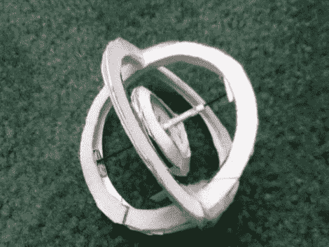

# 纸制陀螺仪

> 原文：<https://hackaday.com/2011/03/26/papercraft-gyroscope/>

尽管春天一直试图打破冬天的沉闷，但在户外季节开始之前，你可能只想再找一次周末活动。抓住孩子们[试试这个纸陀螺](http://www.instructables.com/id/A-Paper-Gyroscope-that-works)。

它不是纸做的电子传感器，而是现代版的陀螺。当中心组件高速旋转时，框架保持静止，使整个装置在一个狭窄的点上保持平衡。[Dombeef]制作一个可打印的模板，您可以用它来制作自己的零件。他拿到了用来装 x 光片的厚纸，但是你可以通过胶水把它们粘在一起，描摹出这些部分的多份拷贝，制成一个结实的切片。以回形针为轴，将内部和外部结合起来，就可以开始了。用力拉一点缠绕在轴上的牙线，让中心框架旋转，然后坐下来，看看它能保持多久。