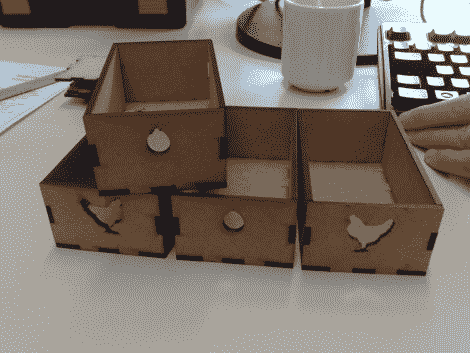

# 参数脚本使激光切割机设计变得轻而易举

> 原文：<https://hackaday.com/2011/07/31/parametric-script-makes-laser-cutter-designs-a-snap/>

[修补匠]从古董店买了一个小橱柜，很好地适应了他的厨房装饰。拿回家后，他意识到有些小格子原来是装抽屉的。原件早就不见了，但这给他提供了一个机会[制作上图](http://www.hackvandedam.nl/blog/?p=64)中的替代品。

进入[修补匠]脑海的第一个设计方法是在 Inkscape 这样的编辑器中绘制各个部分。与当地黑客空间的其他人进行了一些磋商后，他使用了这个基于脚本的参数化 SVG 设计工具。我们直接跳进去试了试，点击 Load–>Construction(类别)–>Better Box。一旦你选择了脚本，点击左栏的“参数”,输入你想要的盒子大小。当所有值都正确时，单击 renter 选项卡，然后将其导出为可缩放矢量图形。

我们已经一次又一次地哀叹[我们缺少激光切割机](http://hackaday.com/2011/04/14/buying-a-laser-cutter-from-china/)，所以我们无法测试出来。但是我们不明白为什么它不能重现[修补匠]取得的同样的结果。