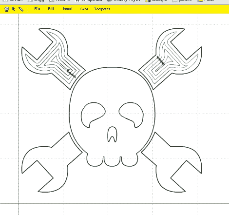

# partsam 在线生成 cam 相关文件

> 原文：<https://hackaday.com/2010/06/02/partkam-produces-cam-related-files-online/>

PartKAM 是由【Jack Qiao】创建的一个[基于 Flash 的 CAM 制作包](http://www.cnczone.com/forums/showthread.php?t=106198)。有大量的计算机辅助制造套件，这个很简单，只需要打开你的浏览器。我们用它玩了一会儿，发现它很有用，但还是有点问题。最明显的是，它没有“撤销”选项。也就是说，你可以导出为 SVG 或 gCode，以便在你只需要[用你组装的](http://hackaday.com/2009/02/01/generating-g-code-with-common-lisp/)[数控铣床](http://hackaday.com/2010/03/24/arm-based-cnc-mill-needs-no-computer/)敲打出几个零件时使用。