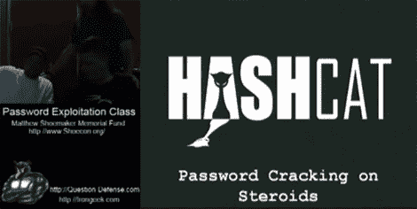

# 在线密码利用课程

> 原文：<https://hackaday.com/2010/09/09/password-exploitation-classes-online/>

Irongeek.com 正在举办一个关于密码利用的在线课程。该活动是一个名为 [ShoeCon](http://www.shoecon.org/) 的资金筹集活动，但他们正在举办整个系列，供大家分享。那里不仅有视频，你还可以下载幻灯片。这里有大量关于各种主题的信息，如 Hashcat、OCLHashcat、Cain、SAMDump2、Nir 的密码恢复工具、密码更新、回溯 4 R1、UBCD4Win。信息太多了，他们把它分成了三个部分。这些视频相当长，每段在 1 到 2.5 小时之间。可能让人们感到惊讶的是谷歌实际上是主要工具之一的时间。

这些视频对于业余黑客、IT 管理员和安全专业人员来说是一个极好的资源。