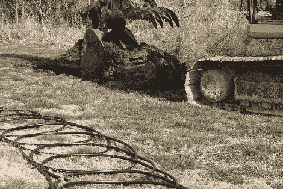

# 使用 1000 Ft^2 地热的电脑冷却

> 原文：<https://hackaday.com/2010/03/22/pc-cooling-using-1000-ft2-geothermal/>

你还在用散热片和风扇给电脑降温吗？蹩脚。撕毁你的财产埋地热线圈肯定是要走的路。[Romir]已经为此工作了大约一个月，刚刚从第一次多日测试中获得数据。花点时间翻翻[他原来的帖子](http://www.overclock.net/cooling-experiments/671177-12-feet-under-1000-square-feet.html)。它包括了他迄今为止发布的 35 条更新的目录。[闭环冷却现在似乎很流行](http://hackaday.com/2009/09/22/seawater-cooled-data-centers/)，我们只是没想到会看到这么大的系统成为个人项目的一部分。我们看的最后一辆[T5 只用了 6 米长的管子。](http://hackaday.com/2009/08/26/foundation-cooling/)