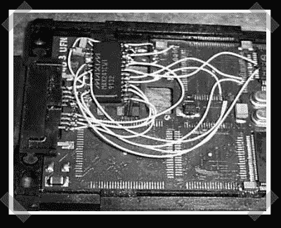

# PCMCIA 调制解调器串行端口

> 原文：<https://hackaday.com/2006/10/27/pcmcia-modem-serial-port/>

【nick Johnson】送进来[今天的黑](http://www.electricstuff.co.uk/diyserial.html)。Mike 移除了额外的硬件，只留下了这台 IBM PCMCIA 调制解调器上的 UART，并用 SMD MAX241 ttl-rs232 转换器取而代之。他在原来的电缆上添加了一个新的末端，最终得到了一个漂亮的 PCMCIA 串行端口。精细的 SMD 焊接很难做到。令人印象深刻的工作。

*   [永久链接](http://www.electricstuff.co.uk/diyserial.html)