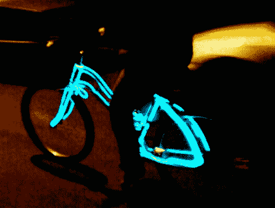

# 脚踏电动电线自行车

> 原文：<https://hackaday.com/2011/02/14/pedal-powered-el-wire-bike/>

Instructables 用户[samsmith17]想为今年的“燃烧的人”在他的自行车上盖一条电线,但他不想麻烦地使用电池作为电源。相反，他决定他的 EL wire 自行车将由骑手单独驱动。为了保持绿色，除了 EL 电线本身，整个建筑由重新设计的部件组成。

如果你不熟悉，EL wire 只有在通交流电流时才会亮，所以他决定用步进电机来产生所需的电流。步进电机安装在他的自行车车轮上，通过一个旧手机充电器的交流变压器部分反向接线，以便逐步增加所需的电压。电路中还增加了一个变阻器，以帮助防止可能损坏或破坏 EL 线的过电压情况。

最终的结果看起来很酷，而且花费很少。很高兴看到有人扩展了他的项目，增加了额外的电线颜色，也许还增加了几个电容器，以防止轮子停止转动后电线立即变黑。

继续阅读，观看已完成项目的快速视频。

[https://www.youtube.com/embed/0n2m4cs3lx0?version=3&rel=1&showsearch=0&showinfo=1&iv_load_policy=1&fs=1&hl=en-US&autohide=2&wmode=transparent](https://www.youtube.com/embed/0n2m4cs3lx0?version=3&rel=1&showsearch=0&showinfo=1&iv_load_policy=1&fs=1&hl=en-US&autohide=2&wmode=transparent)