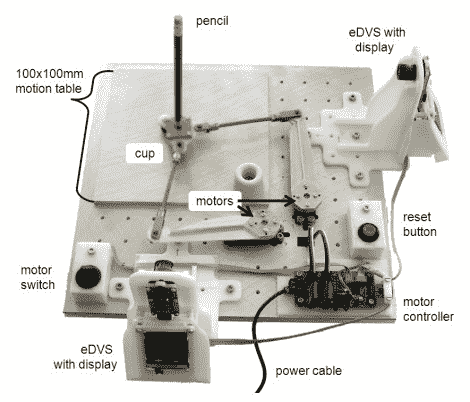

# 铅笔平衡器放在桌上有点吵

> 原文：<https://hackaday.com/2010/11/30/pencil-balancer-a-bit-noisy-for-desk-use/>

谁不想安装[这个小机器人作为你最新的笔筒](http://www.ini.uzh.ch/~conradt/Projects/PencilBalancer/)？把一支铅笔头朝下放，用两个马达就能防止它掉下来。每个轴都有一个动态视觉传感器来提供反馈，但这与使用摄像机不同。这些传感器检测像素对比度的变化，根据铅笔开始下落的方向输出一个正数或负数。以 64 MHz 运行的 NXP2103 读取这些值，并相应地驱动这对伺服电机。

如果你对事实感兴趣，可以从上面链接的页面获得全文。它详细介绍了所使用的算法，并包括显示平衡会话期间数据捕获的图表和直方图。或者你可以跳过那些枯燥的练习，休息后再看视频。

[https://www.youtube.com/embed/f9UngTdngY4?version=3&rel=1&showsearch=0&showinfo=1&iv_load_policy=1&fs=1&hl=en-US&autohide=2&wmode=transparent](https://www.youtube.com/embed/f9UngTdngY4?version=3&rel=1&showsearch=0&showinfo=1&iv_load_policy=1&fs=1&hl=en-US&autohide=2&wmode=transparent)

[通过[y 合成器](http://news.ycombinator.com/item?id=1953717)