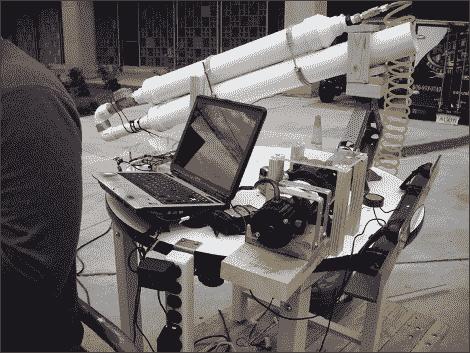

# 完美的螺旋，每次都是

> 原文：<https://hackaday.com/2010/04/30/perfect-spiral-every-time/>

[Carmine]让我们了解一下他团队的[自动足球发射器](http://www.ece.gatech.edu/academic/courses/ece4007/10spring/ECE4007L01/dk3/index.html)。他们的目标是将足球发射器与运动跟踪结合起来，让球员练习奔跑和完美投掷。不幸的是，我们不太确定[什么时候](http://www.ece.gatech.edu/academic/courses/ece4007/10spring/ECE4007L01/dk3/deliverables.html)，他们最终把[的罐子机](http://en.wikipedia.org/wiki/Pitching_machine)换成了空气炮，这导致了泡沫足球的使用和投掷因素如螺旋的损失。有点违背目的，但我们会让它滑动；只是因为我们知道它最终会拍出[土豆](http://hackaday.com/2008/12/29/steam-powered-spud-gun/)。

该项目通过使用两个提供距离和颜色跟踪的相机，结合一个旋转平台(和有史以来最好的花园软管使用)，一个精确的发射器机顶盒来实现。正如在跳跃后的视频中看到的，它工作得非常好。

[https://www.youtube.com/embed/F670W2RKs6I?version=3&rel=1&showsearch=0&showinfo=1&iv_load_policy=1&fs=1&hl=en-US&autohide=2&wmode=transparent](https://www.youtube.com/embed/F670W2RKs6I?version=3&rel=1&showsearch=0&showinfo=1&iv_load_policy=1&fs=1&hl=en-US&autohide=2&wmode=transparent)