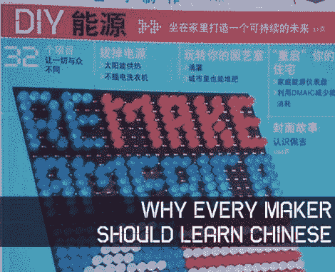

# [菲利普·托伦]关于为什么所有的制造商都应该学习中文

> 原文：<https://hackaday.com/2011/07/08/phillip-torrone-on-why-all-makers-should-learn-chinese/>

不久前，当他在中国工作时，[菲利普·托伦]开始学习汉语普通话，以便帮助他更有效地与同龄人交流。不幸的是，一旦他回到美国，他就开始慢慢忘记他所学的大部分知识。他最近在 Make 上写了一篇文章:解释了他为什么试图再次学习普通话，以及为什么作为一名创客，你也应该考虑这样做。

他首先引用了一些经济趋势，这些趋势表明，在短短几年内，中国在全球 GDP 中的份额可能会超过美国。他表示，虽然这些统计数据可能有点无聊，但一个新的全球超级大国的崛起并不值得忽视。

撇开经济变化不谈，他发现，通过他在 Adafruit 和其他科技公司的工作，他每天都会频繁地接触到越来越多的中国人。在与供应商的电子邮件、数据表和图表之间，他说学习中文是制造商的必修课。

你怎么想呢?你们这些全职创客和黑客有谁在工作中看到了同样的趋势吗？请在评论中告诉我们。