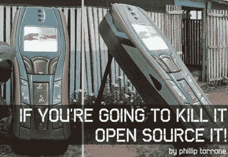

# [Phillip Torrone]恳求公司开放中断项目的源代码

> 原文：<https://hackaday.com/2011/04/29/phillip-torrone-pleads-for-companies-to-open-source-discontinued-projects/>

[PT]刚刚发表了一篇社论，呼吁制造商[通过开源来转移他们停止生产的产品的知识](http://blog.makezine.com/archive/2011/04/if-youre-going-to-kill-it-open-source-it.html)。他的理由是，在开发这些产品上花费了数百万美元和无数工时，但当公司认定该项目不再(或者可能从来都没有)盈利时，这些都付之东流。我们不得不说他说得有道理。给出了“为什么不呢？”就是公司不想给竞争对手任何帮助。但是，想想当我们不能在他人的工作基础上发展时，社会失去了多少机会。

现在[菲利普]并没有停止对新政策的呼吁。他接着列举了一些已经死亡和被埋葬的产品并为其辩护，他希望这些产品的秘密已经被公开。其中包括 Palm V 个人数据助理，IBM 的深蓝，索尼的机器人玩具/宠物，以及其他几个产品。不管怎样，我们可以想到一家公司是这方面的杰出代表；[十多年前 id Software 发布的用于非盈利用途的 Doom](http://en.wikipedia.org/wiki/Doom_source_port) 的源代码。对你有好处！