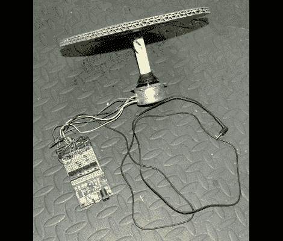
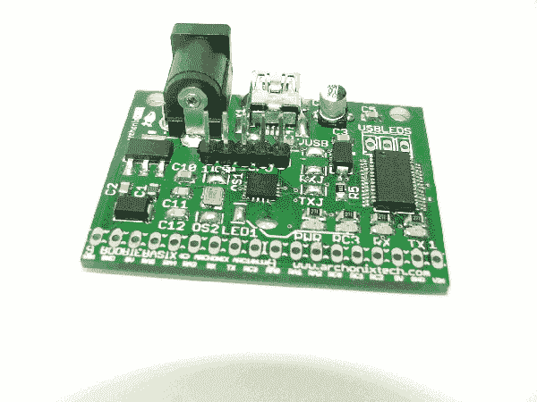

# 自动生成旋转 gif 的照片硬件

> 原文：<https://hackaday.com/2011/06/22/photo-hardware-had-automatically-produces-rotating-gifs/>

[弗格斯·肯德尔的]公司正在制造面向电子爱好者的开发和突破板。正如任何涉及销售的努力一样，他们需要营销。听起来像是[Fergus]负责为每个组件获得一些漂亮的 360 度动画图像。他没有像定格那样用手抓拍照片，而是发明了一个旋转平台来代替他完成这项工作。

操作的大脑是一个布比板，一个微控制器分线板，是他们的产品之一。它通过四个功率晶体管控制连接到纸板平台的步进电机。[Fergus]顺便提到他们的数码相机没有快门触发附件的连接。但是他们修改了它让它工作。没有黑客攻击的细节，但我们打赌他们在快门按钮的触点上焊接了一个晶体管。

步进电机有 48 步，因此硬件被编程为拍摄 48 张图片，这些图片成为动画 GIF 的帧-在休息后嵌入-以展示产品。

