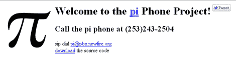

# 圆周率手机用圆周率的数字哄你入睡

> 原文：<https://hackaday.com/2011/03/14/pi-phone-lulls-you-to-sleep-with-the-digits-of-pi/>

众所周知，今天是 3 月 14 日，也就是“圆周率日”。

全国各地的数学教室都在庆祝，这真的是属于极客的庆祝。在 Hack-a-Day，我们也热爱圆周率日，尽管我们可能不会像一些读者表达的那样热情地庆祝它。

[克里斯·普尔]是一个日黑迷，他知道如何充分利用这个数学假期。他开发了一个简洁的基于 SIP 的电话服务，向任何打电话的人大声读出圆周率。他结合 Perl 运行 Asterisk 来读取号码，并使用一个免费的 SIP DID 号码来接听电话。今天早些时候我们试了一下，迎接我们的是一个温和的合成声音，读出圆周率的数字。我们不确定它被编程为处理多少位数字，因为我们在大约 20 位之后停止了，所以给他打个电话，让我们知道你处理了多少位数字。

作为临别赠言，如果没有一些必不可少的与圆周率有关的(虽然很旧)网络漫画和糕点混合物，圆周率日就不完整，所以，来吧！

[XKCD–Pi 等于…](http://xkcd.com/10/)

[XKCD–e 乘以πI](http://xkcd.com/179/)

[XKCD–E 到圆周率减去圆周率](http://xkcd.com/217/)

[球形圆饼派](http://www.boingboing.net/2011/03/14/celebrate-pi-day-314.html)