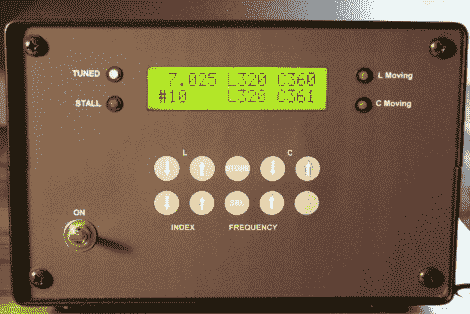

# 基于 PIC 的业余无线电自动调谐器

> 原文：<https://hackaday.com/2011/04/07/pic-based-ham-radio-autotuner/>

几年前，[Floyd，K8AC] [建造了一个高频自动调音器，作为他的业余无线电设置](http://www.k8ac.net/BalancedTuner.html)的补充。基于他在 90 年代初在《QST》杂志上看到的一个设计，他在过去几年中几乎每天都在 3.5 MHz 和 7 MHz 频段上使用调谐器。

建在他无线电室的墙上，这是一个非常令人印象深刻的景象。他的“L”电路由一对机械耦合电感控制，这对电感由一对双向电机共同驱动。C 和 L 组件的定位由 PIC 控制器监控，该控制器存储多达 30 个预定义频率的调谐数据。在他的控制器前端按几个按钮，调谐器就开始工作，将他的感应器和电容器拨到合适的位置。PIC 监控调谐器的进度，当调谐到合适的频率时通知他，或者如果频率不能设置，指示设备的问题。

这些年来，他的设置经历了几次修改，最近的一次是其中自动化程度最高的一次。查看他的网站以了解更多细节，或者在 40 或 80 米处留意[K8AC]。

[谢谢，富 V]