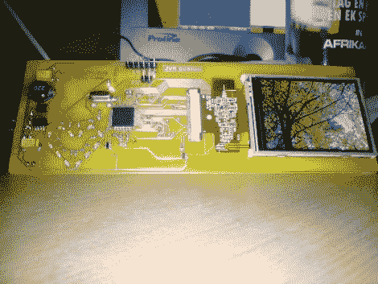
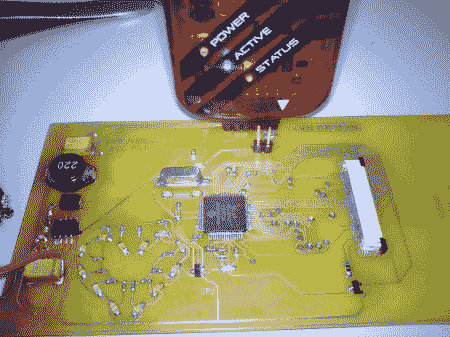

# 基于 PIC 的相框

> 原文：<https://hackaday.com/2010/07/19/pic-based-picture-frame/>

采用 PIC 24HJ256GP206 处理器，添加少量山寨触摸屏和少量 SD 卡兼容性，即可实现 DIY 数码相框。[Daniel]为 HX8347 控制的 LCD 编写了自己的驱动程序，该驱动程序可以在 320×240 分辨率和 16 位颜色下实现 15 FPS。因为这是给他妻子的礼物，[丹尼尔]包括一个心形的 led 环，像电子脉冲一样渐强渐弱。他指出，JPEG 解码器运行速度相当慢，但这主要是因为从 SD 卡访问数据时出现了瓶颈。休息之后，我们得到了更多的图片和源代码的链接。

[源代码](http://blog.mahalo.com/hackaday/misc/pfs.zip)