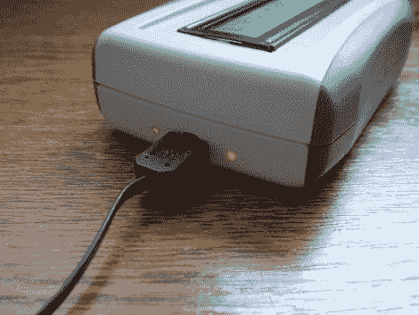

# PIC LC 电表的改进增加了锂离子电池和充电电路

> 原文：<https://hackaday.com/2011/09/20/pic-lc-meter-improvements-add-li-ion-battery-and-charging-circuitry/>

[Trax]需要一个 LC 电表，并决定使用一种可靠的设计来制造自己的电表。唯一的问题是，他不想被绑在长凳上或电源插座上，这意味着需要一点辅助设计。他发明的是[你在](http://www.elektronika.ba/807/lc-meter-with-pic16f628a-redux/)上方看到的电池供电的 LC 电表。

最初的[Phil Rice]设计的核心保持不变，稍加修改即可驱动不同型号的字符 LCD。代码基本没有变化，但是在[Marko]注意到电源循环后的行为中的错误后，一些校准程序变得必要。现在，该器件将在通电或在电感和电容测量功能之间切换后大约 700 毫秒执行相当于硬件复位的操作。这个项目盒子非常小，为了让一切都合适，[Marko]从蓝牙耳机中获得了锂离子电池。他需要 5V 的液晶显示屏，所以他使用了 TPS61222 升压转换器。除了电池，他还包括一个 MAX1811 单电池锂离子充电器，如上图所示，通过外壳可以看到几个状态 led。

[谢谢马尔科]