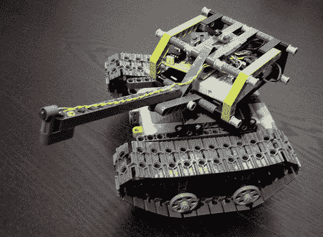

# PicAxe 乐高坦克

> 原文：<https://hackaday.com/2010/02/10/picaxe-lego-tank/>

【tomthe geek】[用 PicAxe 控制器](http://tomthegeek.blogspot.com/2010/01/picaxe-08m-lego-tank.html)搭建了一个乐高坦克。运动由乐高动力功能马达控制器提供。他把一根 LPF 延长线剪成两半，这样他就可以接入 PWM 信号，而不用改变马达本身。你可以辨认出控制电路和坦克炮塔里的一块小试验板。[Tom]在枪管尖端添加了激光笔，但我们希望看到红外 LED。坦克由红外遥控器控制，给玩具添加 TV-b-gone 功能会创造出一种[鲁布·戈德堡功能](http://en.wikipedia.org/wiki/Rube_Goldberg_machine)来关闭电子管。但遗憾的是，由于 PicAxe 08M 被限制为 256 字节，因此没有编程空间。

休息后有一段视频，这个小恶魔在房间里追踪它的路线。这是对我们不久前看到的另一个乐高坦克的一个很好的补充。

[https://www.youtube.com/embed/7kARbk2TKfE?version=3&rel=1&showsearch=0&showinfo=1&iv_load_policy=1&fs=1&hl=en-US&autohide=2&wmode=transparent](https://www.youtube.com/embed/7kARbk2TKfE?version=3&rel=1&showsearch=0&showinfo=1&iv_load_policy=1&fs=1&hl=en-US&autohide=2&wmode=transparent)