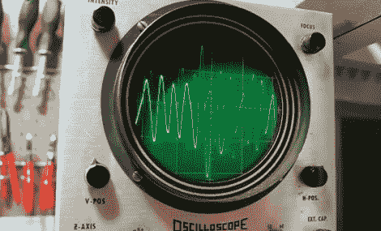

# 用全电子乐队演奏经典的 60 年代音乐

> 原文：<https://hackaday.com/2011/12/06/playing-classic-60s-tunes-with-an-all-electronic-band/>

如果你正在考虑重新利用一些旧的电脑设备来创作音乐，请注意这个门槛已经提高了一点点。YouTube 用户[BD594]花了一些时间筛选他的二手电子产品箱，并组建了一个 5 人乐队，演奏了一首非常棒的动物“旭日东升之屋”。

上周，我们看到了一个令人印象深刻的黑客攻击，他用一个软驱就可以用一个计算器敲出音乐，但这将事情带到了一个全新的水平。[BD594]使用了一台旧的惠普 ScanJet 来模拟歌曲的人声，而一台 Atari 800XL 结合示波器被用作风琴。Ti-99/4a 与另一个示波器配合使用来演奏吉他音符，而 PIC 控制的硬盘驱动器具有双重功能，既可以演奏低音鼓又可以演奏钹。

我们敢说你看了下面的视频后，不会对他的作品留下深刻的印象。

[BD594]说一旦他有一点空闲时间，他就会发布另一个视频——这是我们迫不及待想看到的。

[https://www.youtube.com/embed/w68qZ8JvBds?version=3&rel=1&showsearch=0&showinfo=1&iv_load_policy=1&fs=1&hl=en-US&autohide=2&wmode=transparent](https://www.youtube.com/embed/w68qZ8JvBds?version=3&rel=1&showsearch=0&showinfo=1&iv_load_policy=1&fs=1&hl=en-US&autohide=2&wmode=transparent)