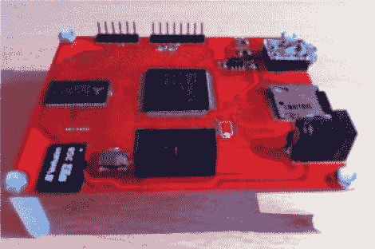

# 从 FPGA 播放 MP3

> 原文：<https://hackaday.com/2012/03/13/playing-mp3s-from-an-fpga/>

建立一个音频播放器是一个有趣的项目。过去这是一项艰巨的任务，但现在 MP3 解码芯片功能齐全，这意味着如果你知道如何用微控制器与其他芯片交流，你就拥有了完成这个项目所需的所有技能。但是这对[超嵌入式]来说太容易了，他决定用 FPGA 制作一个 MP3 播放器。

这并不像听起来那么难。他不需要知道如何解码音频压缩。相反，他将 Helix MP3 解码器库加入到项目中。它已经被优化为在 ARM 处理器上运行，由于他使用的是 RISC 软处理器，翻译一点也不困难。他使用 24 位立体声 DAC 芯片来桥接音频插孔和 FPGA 输出之间的差距。用 FPGA 为该芯片计时并不理想，会导致 44.1 kHz 音频运行速度慢 3%。他说这不明显，我们相信。但是如果你试着跟着一首歌演奏，音调的变化可能会让你发疯。

如果你更喜欢坚持使用基于微控制器的播放器[，这款小而便宜](http://hackaday.com/2010/12/13/mp3-player-barely-larger-than-an-sd-card/)。