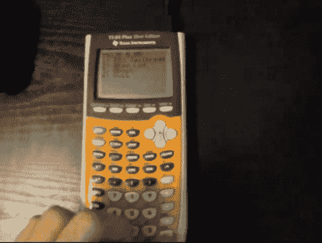

# PlayStation 3 利用 TI84 计算器

> 原文：<https://hackaday.com/2010/09/10/playstation-3-exploit-using-a-ti84-calculator/>

[布兰登·威尔逊]想出了一个利用 TI84 计算器开发 Play Station 的方法。这使用了我们上周看过的相同的 [PSGroove 开源代码](http://hackaday.com/2010/09/01/open-source-version-of-the-play-station-3-jailbreak/)。该软件包在 Teensy，[上运行，目前已售罄](http://www.pjrc.com/store/teensypp.html)(我们猜测是因为人们想运行该漏洞)。休息之后会有一段新把戏的视频演示。计算器通过 USB A 到 USB mini-B 电缆连接，该电缆随计算器一起提供，也用于为 PS3 控制器充电。连接完成后，启动计算器上的软件，重启 PS3，然后按下熟悉的电源弹出按钮开机。该系统的唯一问题是，每次启动时都需要连接计算器。

[https://www.youtube.com/embed/vOSpCoCmOns?version=3&rel=1&showsearch=0&showinfo=1&iv_load_policy=1&fs=1&hl=en-US&autohide=2&wmode=transparent](https://www.youtube.com/embed/vOSpCoCmOns?version=3&rel=1&showsearch=0&showinfo=1&iv_load_policy=1&fs=1&hl=en-US&autohide=2&wmode=transparent)

[谢谢斯科特]