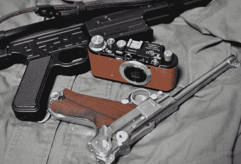

# 在经典相机机身中瞄准并拍摄

> 原文：<https://hackaday.com/2010/05/12/point-and-shoot-in-a-classic-camera-body/>

如果你认为相机里有枪，那你就上当了。我们只是喜欢将 20 世纪 40 年代的相机与标志性的随身武器并置在一起。你看到的是经典的徕卡 II 机身内部的一个傻瓜相机(这实际上是一个山寨的 T2 佐基 1)。这很像[佳能 AE-1](http://hackaday.com/2010/05/05/classic-canon-ae-1-gets-a-digital-upgrade/) 黑客，但这一次有大量的建设细节。

数码相机制造商试图获得尽可能最小的外形，因此这些东西的内部是微小零件和复杂连接的噩梦。索尼 DSC-WX1 也不例外，连电池都拆了放进去。休息后，在视频中查看最终产品及其功能。

[https://www.youtube.com/embed/UJDtmcWiaVM?version=3&rel=1&showsearch=0&showinfo=1&iv_load_policy=1&fs=1&hl=en-US&autohide=2&wmode=transparent](https://www.youtube.com/embed/UJDtmcWiaVM?version=3&rel=1&showsearch=0&showinfo=1&iv_load_policy=1&fs=1&hl=en-US&autohide=2&wmode=transparent)
【感谢丹尼斯】