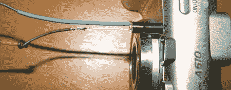

# 将 CHDK 移植到新相机上

> 原文：<https://hackaday.com/2008/05/27/porting-chdk-to-new-cameras/>

在研究 [CHDK 如何做](http://www.hackaday.com/2008/05/27/how-to-expand-your-camera-with-chdk/)的时候，我们看到了团队对[将固件移植到全新相机](http://chdk.wikia.com/wiki/Porting_the_CHDK)的指示。理论上，CHDK 应该可以在任何运行 DIGIC II 或 III 处理器的佳能上工作，因为大多数佳能都运行相同的 VxWorks 操作系统。在移植工作开始之前，需要转储摄像机的固件。在一些相机上，固件是使用软件检索的，但其他相机需要硬件路径。上图是一台佳能 A610，它使用内置 LED 慢慢闪烁出固件的每一个细节。光电二极管与声卡相连，声卡上记录了整个比特流。读取整个固件需要 1-7 个小时。一旦声音文件被捕获，它就被还原为原始字节，然后可以用类似 IDApro 的东西进行反编译。

*   [永久链接](http://chdk.wikia.com/wiki/Porting_the_CHDK)