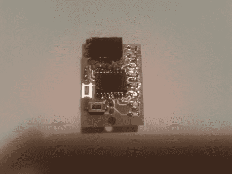

# 从原型到 SMD 板的 POV 钥匙圈

> 原文：<https://hackaday.com/2011/09/02/pov-keychain-from-prototype-to-smd-board/>

[Augusto]来信告诉我们他的钥匙链大小的视觉暂留项目。他在一些原型板上构建了原始原型，使用 PIC 16F627 来驱动八个 led。同步由电路板上的倾斜传感器管理，该传感器启动选通脉冲以匹配电路板移动的方向。这与使用加速度计的 [POV 设备的设置类似，但是为倾斜开关编码应该容易得多。](http://hackaday.com/2011/04/26/small-pov-device-shows-off-some-big-features/)

一旦[Augusto]有了硬件，他就开始设计表面贴装设计。两节 AAA 电池换成了一节 3V 硬币电池，就在你上面看到的电路板背面。这是他第一次尝试使用表面贴装元件，我们认为他做得很好。休息后，请查看视频中正在运行的视点。

[https://www.youtube.com/embed/KlVYUM5faIM?version=3&rel=1&showsearch=0&showinfo=1&iv_load_policy=1&fs=1&hl=en-US&autohide=2&wmode=transparent](https://www.youtube.com/embed/KlVYUM5faIM?version=3&rel=1&showsearch=0&showinfo=1&iv_load_policy=1&fs=1&hl=en-US&autohide=2&wmode=transparent)