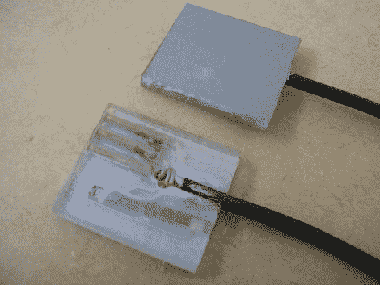

# 不带外部插孔的数码相机电源适配器

> 原文：<https://hackaday.com/2011/02/20/power-adapter-for-digital-cameras-without-an-external-jack/>

[Kusnick]正在使用数码相机来扫描书籍。问题是，保持电池充电是一件痛苦的事情，但没有外部交流适配器插孔可以让他使用电源。他的解决方案是[制造自己的适配器来替换电池](http://diybookscanner.org/forum/viewtopic.php?f=1&p=9034)。

有一些别致的书籍扫描设置，允许你只是翻阅页面，但更简单的是[建立一个使用两个摄像头的装备。[kus nick]的设置是后者，这意味着他找到了两个不需要移动的廉价相机。制造适配器的第一次尝试以一块丙烯酸树脂为特色，正负触点连接到屏蔽线，然后他将屏蔽线连接到外部电源。相机会打开，然后关闭，理由是相机“只使用兼容的电池”。原来专利电池内置了某种验证电路。但是解决这个问题很容易。将电路板从电池中取出，并将其插入适配器中，以欺骗相机。](http://hackaday.com/2009/04/20/high-speed-book-scanner-from-trash/)

[谢谢丹尼尔]