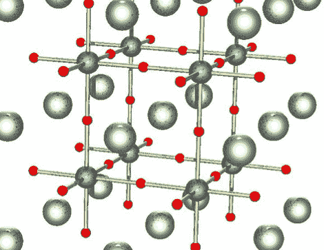

# 全身充满力量

> 原文：<https://hackaday.com/2010/12/03/power-all-over-your-body/>

我们知道，你可以将身体的机械运动转化为电能，就像你转动曲柄或摇动机械驱动的手电筒一样。与你日常(和每分钟)进行的许多动作相比，这些类型的机械运动相当大，例如走路、呼吸和拇指摔跤。

如果我们能从这些微小的运动中获取能量呢？韩国科学技术高级研究所的研究人员正在用压电钛酸钡寻找这个问题的答案。他们的设备的电输出非常小(以纳安计)，但在很长一段时间内，经过多次重复，就有可能运行一个小的电子设备——甚至是一个生物嵌入式设备。替代[的血能](http://www.physorg.com/news122819670.html)？

这项技术显然有很大的潜力，我们很有兴趣看看我们是否以及何时可以开始摆弄这些东西。见鬼，它已经被用来给一个小 LED 供电了，你们都知道每个人会多么渴望有机会[把自己覆盖在自供电 LED 中……](http://hackaday.com/2010/09/30/dazzling-coat-sure-to-be-in-demand-with-pimps-everywhere/)