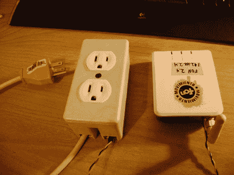

# 关断有问题的调制解调器

> 原文：<https://hackaday.com/2010/06/29/power-cycling-a-problematic-modem/>

[Gigawatts]与劣质的互联网连接抗争了很长一段时间。更换调制解调器、维修线路、花太多时间打电话都没有任何好处。事实上，解决问题的唯一方法是在调制解调器停止响应后重启。他的解决方案是[自动化电源循环过程](http://stupidhax.blogspot.com/2010/02/fonera-automated-reset-technology-take.html)。他给运行 DD-WRT 的路由器添加了一个 cron 任务，DD-是被黑客攻击的[路由器](http://hackaday.com/2010/01/13/lego-router-case-bests-factory-finish/)最喜欢的固件替代品。该脚本监控 WAN 连接，当连接中断时，它会切换其中一个串行端口引脚。他拿起一个插座盒，里面有一个继电器，用那个串行引脚切断了调制解调器的电源。一个变通办法是的，但这是结束他沮丧的唯一办法。