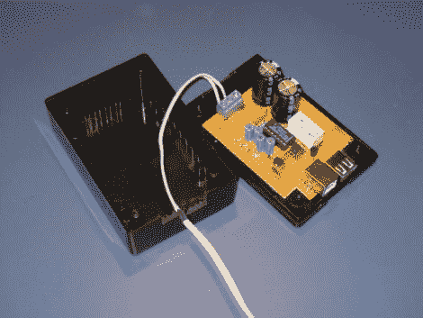

# 电源板黑客降低待机功耗

> 原文：<https://hackaday.com/2011/11/21/power-strip-hack-reduces-standby-electricity-consumption/>

多年来，[Rasmus]一直让他的电脑直接连接到主电源，以便他可以通过局域网唤醒来打开它。关机时，它仍然会持续消耗大约 6W 的电力，但现在他不需要它经常处于待机状态，[他想让它更加节能。](https://sites.google.com/site/rasmusprojects/standby-0w)

在他居住的丹麦，许多人使用带有 USB 线的电源板。这些插条旨在通过仅在计算机处于活动状态时打开电源插座来降低显示器等 PC 外围设备的待机功耗。他决定将待机能耗降低到 0W 的最简单方法就是也通过这个带给他的电脑供电。

虽然这在理论上听起来很棒，但它提出了一种先有鸡还是先有蛋的问题。如果计算机需要打开电源插排才能识别它，那么他又怎么可能从同一个插排给计算机供电呢？他的解决方案是一个小电路，它可以在电脑运行时充电，并仍然保持足够的电量来启动电脑的启动过程，从而打开电源板。

这真是一个巧妙的处理事情的方法，干得好！