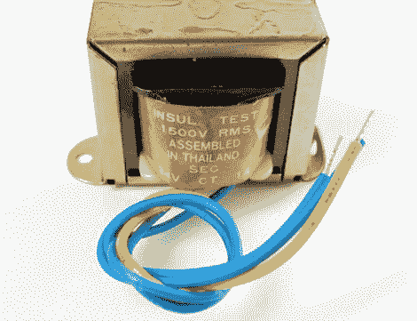

# 电源和变压器；学习经历

> 原文：<https://hackaday.com/2010/10/27/power-supplies-and-transformers-a-learning-experience/>

[Ladyada]正在制作一个关于电源的系列教程。如果你曾经做过一个电子项目，你会使用某种类型的电源，但我们认为大多数人不知道如何将市电转换成大多数小型项目使用的 DC 电压。因此，如果你想学习，从第一部分开始，其中[介绍了基于如上所示变压器的交流/DC 转换器](http://www.ladyada.net/wiki/tutorials/learn/powersupply/transformeracdc.html)。

这些变压器装在许多电子产品自带的厚重、发热的壁式电源插头中。当[构建南瓜 LED 矩阵](http://hackaday.com/2010/10/26/70-led-matrix-in-a-jack-o-lantern/)时，我们使用了一个和试验板电源。他们用一对线圈将电压降低到一个非常小的水平。接下来就是把交流电整流成 DC 电力的问题，她在一个容易理解的讨论中谈到了这一点。

我们非常了解这种类型的转换器，但对于不使用变压器的开关模式交流/DC 转换器，我们就有些模糊了。它们要好得多，因为您不必像处理 wall-warts 那样在目标项目中构建监管器。等不及她看到系列的那一部分了！