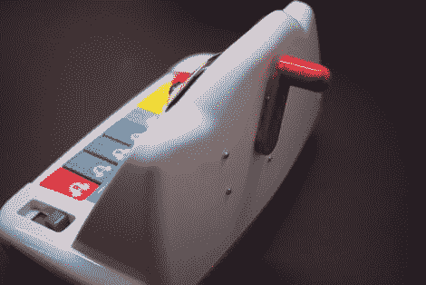

# 手动驱动儿童玩具

> 原文：<https://hackaday.com/2011/10/18/powering-kids-toys-by-hand/>

(张秀坤的)女儿有一架她喜欢的旧玩具钢琴，但当电池开始耗尽时，它发出可怕的声音，听起来也不协调。虽然这可能是我们的电路弯曲朋友感兴趣的事情，但[张秀坤]更喜欢事情听起来更愉快。

他考虑过简单地更换电池，但这似乎是一个更好的主意。他四处寻找解决方案，最终在当地宜家商场找到了。他抓起一个 LJUSA 手动手电筒，把它拆开，省去了曲柄和电路。

他将曲柄安装在女儿钢琴的背面，并将电子元件安装在玩具的外壳内。曲柄带动一个无刷电机旋转，产生交流电流，该电流在储存到电容器中之前被整流成 DC。他说，一个 30 秒的曲柄只能播放几首曲子，这并不理想，尽管这比频繁更换电池要好。

[谢谢，罗杰]