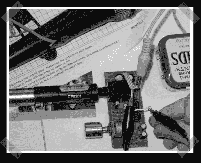

# 前置放大器再循环

> 原文：<https://hackaday.com/2007/03/17/preamp-recycling/>

【lgbsneak】找到了一个很好的[前置放大器来源](http://sneaktime.net/2007/03/13/homemade-preamp)来满足他的需求。一些老的接收器，像他的老肯伍德 KA-305 有模块化前置放大器。所以只需要把它拆下来，打开电源，扔进一个盒子里。现在他有了一个方便的 9v 电池供电的前置放大器，用于野外工作。

*   [永久链接](http://sneaktime.net/2007/03/13/homemade-preamp)