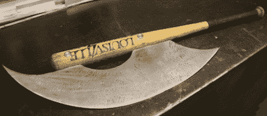

# 为僵尸末日做准备

> 原文：<https://hackaday.com/2011/10/31/preparing-for-the-zombie-apocalypse/>

每个理智的人都在为未来做准备。无论是匹配你雇主的 401k 缴款，确保你在暴风雪前有面包和牛奶，还是为你孩子的大学基金储蓄，为未来做计划会让你过上舒适的生活。[高德]有非凡的远见；他为即将到来的僵尸末日建造了一个令人敬畏的[路易斯维尔十倍体](http://gordsgarage.wordpress.com/2011/10/31/thoughts-for-food/)。

一颗子弹击中大脑会阻止僵尸，这是一个都市传说。瞬间钻孔对活人来说是毁灭性的，但我们在这里谈论的是不死生物。你要的是近战武器，你必须砍掉它的头。[高德]他的项目是围绕一个路易斯维尔的强击手。刀片是一块 20 英寸长的等离子切割低碳钢。这只是一个原型，以获得平衡；最终版本将由碳钢制成。

刀片的柄脚与球棒的两个凹槽相吻合。刀片由两个垂直于刀片的定制垫片固定。我们不太确定最终武器的命名(我们确定是某种战斧)，但我们想不出更好的方法来斩首亡灵。