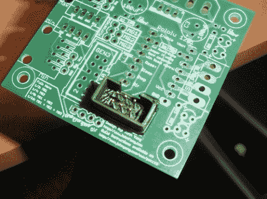

# 打印您自己的顶盖护罩

> 原文：<https://hackaday.com/2011/04/11/print-your-own-header-shrouds/>

不要误解我们，可打印的口哨很酷，但是这些可打印的头罩让我们认为像 Makerbot 和 RepRap 这样的细丝打印机可能是值得的。这种功利的目的背离了我们习惯于从昂贵的开发工具~~玩具~~中看到的[纪念品](http://hackaday.com/2011/04/07/art-installation-lets-you-be-your-own-souvenir/)、[玩具](http://hackaday.com/2011/04/02/3d-printed-gun-fires-nerf-darts/)和[艺术品](http://hackaday.com/2011/04/01/3d-printer-gets-a-big-resolution-improvement/)。

六针和十针接头护罩设计为紧密配合，便于将它们粘到公针接头的塑料垫片上。我们在项目中一直使用 IDC 插头和带状电缆，但似乎从未订购屏蔽连接器；这对我们来说再好不过了。这让我们想知道我们还错过了哪些 PCB 友好型可印刷设计？肯定有人在印刷带螺纹插件的支架，对吗？如果你知道一些有用的东西，我们可以与其他读者分享，不要犹豫，发送提示。

[via [危险原型](http://dangerousprototypes.com/2011/04/06/3d-printable-idc-header-shrouds/)