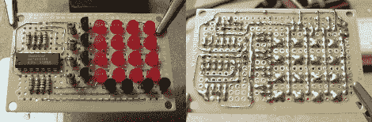

# 印刷电路板减去印刷走线

> 原文：<https://hackaday.com/2010/06/11/printed-circuit-board-minus-the-printed-traces/>

读者[Osgeld]是一个棋盘布局忍者。他在一开始没有布局规划的情况下组装了这块 4×4 LED 矩阵板。[看它以幻灯片的形式展开](http://www.instructables.com/id/Single-chip-2-wire-4x4-LED-matrix/)看他表演的艺术作品。显示器由移位寄存器驱动，他包括了所有合适的部件，如电阻和晶体管，但他让一切都适合。这有什么了不起的？他用的是未绝缘的电线，没有一根电线与另一根电线交叉。他正在设计一个印刷电路板，一边焊接一边走线。他已经建立了这个使用[一个 Arduino 移位寄存器教程](http://www.instructables.com/id/The-74HC164-Shift-Register-and-your-Arduino/)和我们唯一的问题是在哪里头钩这个板到一个微控制器？