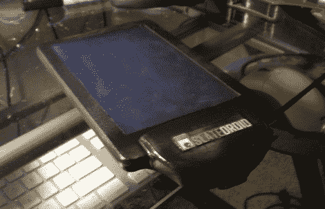

# Apex 项目，Apad Mod

> 原文：<https://hackaday.com/2010/07/01/project-apex-apad-mod/>

当他把他的 Apad/M002 改装成他所谓的 [Project Apex](http://www.slatedroid.com/vbulletin/showthread.php?963-Pimp-My-M002-%28Project-APEX%29) 时，[食肉动物]试图打破尽可能多的(非官方)记录。记录 1:[德里克]声称这是有史以来第一个 Apad 国防部。创纪录的 2 号:8500 毫安时电池，使该设备的寿命达到 12 小时，比任何其他 [Android 平板](http://www.slatedroid.com/vbulletin/showthread.php?206-apad-battery-life)都长。记录 3:漂亮的工厂外观。好吧，所以最后一个不是真正的记录，但我们认为项目顶点无论如何值得。对该设备还做了一些其他的修改；点击链接或观看他在起跳后展示石板的视频。

[谢谢德里克·休斯]

[https://www.youtube.com/embed/VAaVDPW_gnQ?version=3&rel=1&showsearch=0&showinfo=1&iv_load_policy=1&fs=1&hl=en-US&autohide=2&wmode=transparent](https://www.youtube.com/embed/VAaVDPW_gnQ?version=3&rel=1&showsearch=0&showinfo=1&iv_load_policy=1&fs=1&hl=en-US&autohide=2&wmode=transparent)