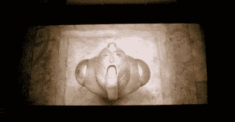

# 投影仪黑客综述

> 原文：<https://hackaday.com/2008/05/22/projector-hacks-roundup/>

投影仪一直是硬件黑客们最喜欢的玩具。从反应式显示器到廉价的家庭影院，有很多理由玩光子。看到一些[便宜的投影仪维修](http://www.hackaday.com/2008/05/22/cheap-projector-repair/)让我们有心情去报道一些我们最喜欢的投影仪项目——休息之后去看看吧。

<http://www.youtube.com/v/5s5EvhHy7eQ>

  
如果我们没有马上提到【李炯楷】的交互式白板，那将是我们的疏忽。他的软件使用 LED 光笔和 wiimote 来检测用户的动作。如果你正在寻找代码，点击本页[的第二个项目](http://www.cs.cmu.edu/~johnny/projects/wii/)。哦，别忘了他的[自动投影仪校准](http://www.hackaday.com/2007/11/15/automatic-projector-calibration/)项目。

投影仪是真正 DIY 者的理想之选。拿一个标准的台式机或笔记本电脑 LCD，剥去外壳，添加一些光学元件和一个像样的光源(金属卤化物灯很好)，你就有了自己的投影仪。他们可以生产高清质量或尽可能便宜地建造。不久前，我们为 engadget 撰写了[我们自己的版本](http://www.engadget.com/2006/12/13/how-to-hd-projector-wrap-up-and-review-aka-part-7/)。

如果你正在考虑构建自己的项目，你应该考虑一些更好的定制投影仪控制器项目，比如 [P-Brain](http://www.diyaudio.com/forums/showthread.php?s=b1f23e5fd0da2576206e28659d1a6c13&threadid=62055&perpage=25&pagenumber=1) 。

我们见过几个 DIY 屏幕。[遮光布](http://www.engadget.com/2006/08/29/how-to-make-a-custom-projector-screen/)版、[特卫强/PVC](http://www.instructables.com/id/Tyvek-Projector-Screen/) 版、[混搭](http://www.avsforum.com/avs-vb/showthread.php?t=662348)油漆版和 DIY [电动](http://www.hackaday.com/2006/01/21/motorized-projector-screen/)版。