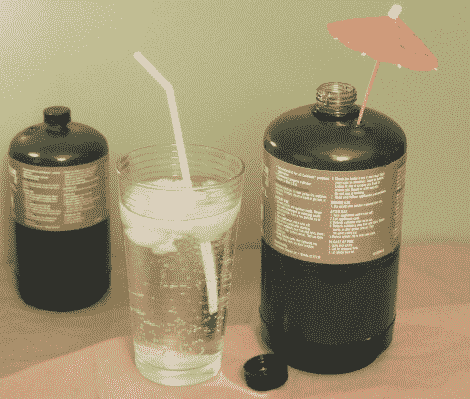

# 丙烷储罐-ard

> 原文：<https://hackaday.com/2011/02/25/propane-tank-ard/>

[hpstoutarrow]新的 instructable 是一个如何再利用这些一次性小丙烷瓶的好主意，它可以变成一个隔热水壶。一旦瓶子在正常使用过程中被清空，安全阀就会被弹开并允许排气。这篇文章也有一些评论建议将瓶子浸入水中，以确保所有的气体都消失，我们认为这也是明智的。

一旦工作安全，底部被切开，茎被切断，留下一个空壳，苏打水瓶子被里面的沸水收缩一点点，然后放入丙烷瓶子。汽水瓶的顶部由一个 O 型圈固定，安全压力孔被堵住，整个瓶子被喷射的“膨胀 O 型泡沫”填满，将所有东西固定住，并增加隔热效果。

虽然使用热塑塑料瓶子作为内衬不会邀请热饮料参加聚会，但它似乎可以很好地完成冷饮的工作，而且它可以成为野营地的一个有趣的话题。

休息之后，请加入我们，观看快速操作视频。

[https://www.youtube.com/embed/UcAK6SZ0_sI?version=3&rel=1&showsearch=0&showinfo=1&iv_load_policy=1&fs=1&hl=en-US&autohide=2&wmode=transparent](https://www.youtube.com/embed/UcAK6SZ0_sI?version=3&rel=1&showsearch=0&showinfo=1&iv_load_policy=1&fs=1&hl=en-US&autohide=2&wmode=transparent)