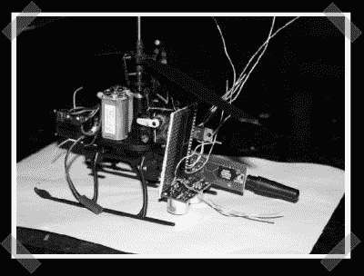

# 螺旋桨无人机直升机

> 原文：<https://hackaday.com/2007/08/17/propeller-based-uav-helicopter/>

我猜我们正在进行一场无人机竞赛——当我在寻找有趣的[螺旋桨](http://www.parallax.com/propeller/index.asp)项目时，我偶然发现了[这个](http://www.tarbox.org/helicontrol.html)项目。[格伦]正在建造这个基于他拿起的遥控直升机。控制器和直升机都收到了一个螺旋桨芯片，以及一个非常标准的直升机导航传感器阵列。这是一项正在进行的工作，但有时这些是最鼓舞人心的。

*   [永久链接](http://www.tarbox.org/helicontrol.html)