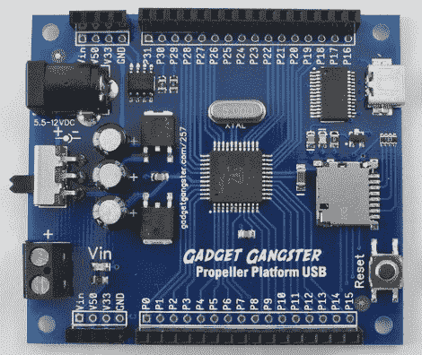

# 螺旋桨平台原型板获得升级

> 原文：<https://hackaday.com/2010/10/19/propeller-platform-prototyping-board-gets-an-upgrade/>

[Nick]Gadget Gangster 有一个新版本的推进器微控制器原型硬件，名为[推进器平台 USB](http://gadgetgangster.com/find-a-project/56?projectnum=257) 。一年多前[我们看到了最后一个版本](http://hackaday.com/2009/08/26/propeller-platform/)，它更大，使用 DIP 处理器，并且是未组装的。新版本确实是组装的，因为迁移到表面贴装元件(如果你只是喜欢焊接套件，这可能会使它失去一些乐趣)。这不仅减小了电路板的尺寸，还为更多器件腾出了空间。顾名思义，现在有一个带 USB 到 UART 桥的迷你 USB 插座，增加了一个 microSD 卡插槽，板载 EEPROM 增加了一倍。这是一次不错的硬件升级，但价格也提高了 25 美元。别担心，它是开源的，所以如果你手头有部件，你可以自己开发。