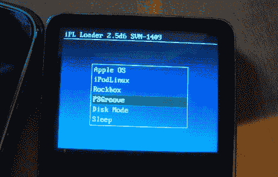

# PS3 越狱-现在苹果风味！

> 原文：<https://hackaday.com/2010/09/25/ps3-jailbreak-now-in-apple-flavor/>

PS3 越狱工具的最新成员是 iPod 家族。更具体地说，运行开源媒体固件的 ipod[rock box](http://www.rockbox.org/)。更好的消息是，理论上应该可以在任何运行 Rockbox 软件的 MP3 播放器上使用同样的方法。目前，漏洞利用包只在 iPod Nano 和 iPod Classic 系列的特定产品上运行，但如果 PSX 现场论坛设定的趋势继续下去，如果你的设备还不支持，那么在不久的将来就值得检查一下。感谢[shuffle2]提供的破解，以及[DanAdamKOF]的提醒。

如果苹果不是你的首选设备，你也可以查看一下你的[的](http://hackaday.com/2010/09/10/playstation-3-exploit-using-a-ti84-calculator/)[部分](http://hackaday.com/2010/09/15/psgroove-on-a-pic-microcontroller/)其他越狱[选项](http://hackaday.com/2010/09/01/open-source-version-of-the-play-station-3-jailbreak/)。