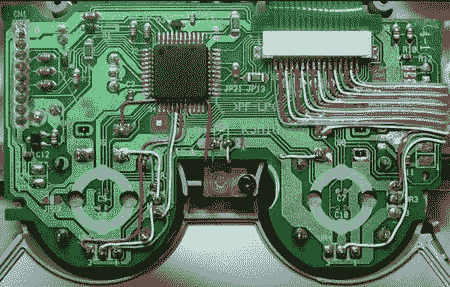

# PSP 外部控制器布线

> 原文：<https://hackaday.com/2008/05/30/psp-external-controller-wiring/>

Acimods 贡献者[Blizzrad]刚刚完成了一个我们所见过的最干净的 mods。通过对 PSP 外部的最小改动，他能够[增加一个外部 PS2 控制器](http://www.acidmods.com/forum/index.php?topic=18967)。这自然需要大量的内部修改。控制器和 PSP 使用从笔记本电脑上抢救下来的 25 针 SMT 连接器。控制器的连接器外壳由一组组件电缆组成。休息后的视频加上一些布线图。

[https://www.youtube.com/embed/nTDq2-jaEo0?version=3&rel=1&showsearch=0&showinfo=1&iv_load_policy=1&fs=1&hl=en-US&autohide=2&wmode=transparent](https://www.youtube.com/embed/nTDq2-jaEo0?version=3&rel=1&showsearch=0&showinfo=1&iv_load_policy=1&fs=1&hl=en-US&autohide=2&wmode=transparent)

【Blizzrad】为 PSP/PS2 控制器整理了一份[很棒的接线指南。使用 30AWG 电线需要做很多细致的工作，但他已经完成了大部分艰苦的工作，确定了可以使用哪些过孔以及应该在哪里布线。我们喜欢看到人们花时间记录这样困难的任务。](http://www.acidmods.com/forum/index.php?topic=17761.msg133741#msg133741)

[via [Engadget](http://www.engadget.com/2008/05/30/psp-hacked-for-use-with-dualshock-controller/)

*   [永久链接](http://www.acidmods.com/forum/index.php?topic=18967)