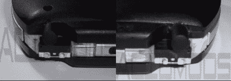

# PSP L2/R2 按钮模式

> 原文：<https://hackaday.com/2008/06/14/psp-l2r2-button-mod/>

这正迅速成为一个无意的“游戏手柄星期六”。我们最近没怎么报道 PSP，所以这是一种享受。AcidMods 论坛成员[Electro]为[在 PSP](http://www.acidmods.com/forum/index.php?topic=15108.0) 上添加两个缺失的肩钮整理了一份快速指南。L2 和 R2 按钮在玩 Playstation 1 游戏时使用，通常映射到操纵杆上的方向。这种模式跳过操纵杆的触点，将按钮重新定位到肩膀上。帖子中使用的开关似乎有点笨重，但你可以随意使用任何合适的开关。

[via [Engadget](http://www.engadget.com/2008/06/14/psp-l2-and-r2-button-mod-aint-pretty-gets-the-job-done/)

*   [永久链接](http://www.acidmods.com/forum/index.php?topic=15108.0)