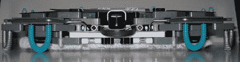

# 普利托:乐高 Roomba

> 原文：<https://hackaday.com/2010/11/14/pulito-the-lego-roomba/>

当[Dave]在家里安装硬木地板时，他需要一个解决方案来帮助自动化日常清扫的单调任务。他决定利用自己对乐高机器人的热情，设计并制造一个基于 NXT 的 Swifferbot，他称之为 Pulito。他的版本实现了所有重要的功能，如使用碰撞传感器避免物体，用于自动返回充电站的红外信标，以及监控电池充电的光敏电阻。[戴夫]还包括一个漂亮的[乐高传感器多路复用器](http://www.plastibots.com/?p=1564)，让他节省 I/O 端口，这几乎值得单独分享。

休息后的视频。

[https://www.youtube.com/embed/eO9buKXiQe8?version=3&rel=1&showsearch=0&showinfo=1&iv_load_policy=1&fs=1&hl=en-US&autohide=2&wmode=transparent](https://www.youtube.com/embed/eO9buKXiQe8?version=3&rel=1&showsearch=0&showinfo=1&iv_load_policy=1&fs=1&hl=en-US&autohide=2&wmode=transparent)

[https://www.youtube.com/embed/UZZhOGgeuts?version=3&rel=1&showsearch=0&showinfo=1&iv_load_policy=1&fs=1&hl=en-US&autohide=2&wmode=transparent](https://www.youtube.com/embed/UZZhOGgeuts?version=3&rel=1&showsearch=0&showinfo=1&iv_load_policy=1&fs=1&hl=en-US&autohide=2&wmode=transparent) [https://www.youtube.com/embed/vjcm1EzqlNY?version=3&rel=1&showsearch=0&showinfo=1&iv_load_policy=1&fs=1&hl=en-US&autohide=2&wmode=transparent](https://www.youtube.com/embed/vjcm1EzqlNY?version=3&rel=1&showsearch=0&showinfo=1&iv_load_policy=1&fs=1&hl=en-US&autohide=2&wmode=transparent)