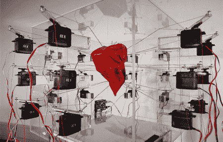

# 脉搏，情感可视化的有机体

> 原文：<https://hackaday.com/2008/07/07/pulse-the-emotional-visualization-organism/>

【Markus Kison】搭建了一个叫 Pulse 的装置，一部分是艺术装置，一部分是数据可视化工具。被称为 Pulse 的[情绪可视化有机体实际上做的是扫描 Blogger.com 博客上的新帖子，寻找与来自八个情绪群体的 24 种不同情绪相关的关键词的同义词。当检测到关键词时，中间的红色圆锥会扩大，实际上是 Blogger.com 博客的情绪指示器。](http://www.markuskison.de/pulse/)

24 种不同的情绪基于[【罗伯特·普卢奇克】的情绪心理进化理论](http://www.fractal.org/Bewustzijns-Besturings-Model/Nature-of-emotions.htm)，设备本身由玻璃外壳、各种伺服电机和伺服系统的定制控制器组成。这是一个令人信服的想法，但我们想知道它是扫描修饰词还是只扫描关键词。如果许多人同时发布“我一点也不难过”这句话，那么悲伤区域急剧扩大就没什么意义了。休息后嵌入的视频。

<http://www.vimeo.com/moogaloop.swf?clip_id=1181423&amp;server=www.vimeo.com&amp;show_title=1&amp;show_byline=1&amp;show_portrait=0&amp;color=&amp;fullscreen=1>

【via [信息美学](http://infosthetics.com/archives/2008/07/pulsating_emotion_visualisation_organism.html)

*   [永久链接](http://www.markuskison.de/pulse/)