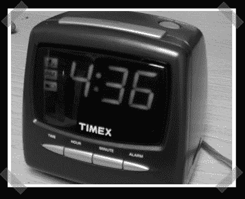

# 敲你的闹钟

> 原文：<https://hackaday.com/2007/08/24/punch-your-alarm-clock/>

[这个](http://www.dimensionengineering.com/appnotes/alarmclock/alarmclock.htm)大概是我见过的最有娱乐性的“应用笔记”了。这些东西通常有点干涩，好吧，它们让你的目光转向一种之前未知的物质状态。这一个包括让你的闹钟在你打闹的时候打盹儿。诀窍？在贪睡按钮上连接一个加速度计。这需要一点支持电路，但看起来对任何人来说都是可行的。感谢[安迪]送来。

嘿，我们有一条[提示线](http://hackaday.com/tips)。把你的黑客送进来！

*   [永久链接](http://www.dimensionengineering.com/appnotes/alarmclock/alarmclock.htm)