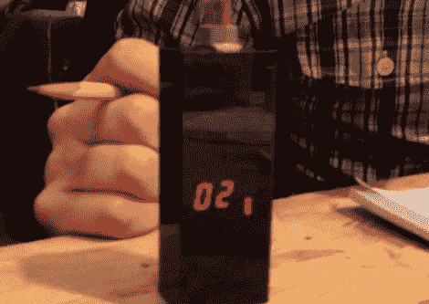

# Puncher 跟踪你的自由职业时间，在运输安全管理局巡逻的时间

> 原文：<https://hackaday.com/2012/02/12/puncher-tracks-your-freelancing-hours-time-spent-in-tsa-patdowns/>

[拉斐尔·艾布拉姆斯]做了很多自由职业者的工作，但他很难准确记录自己为客户投入的时间。在尝试了各种记录时间的应用程序和方法后，他最终决定[建造一个能以他喜欢的方式工作的设备。](http://www.nycresistor.com/2012/02/08/raphs-puncher-freelance-time-tracking-device/)

他称他的装置为“自由打孔机”，尽管它已经有了引爆器的绰号，因为它看起来像是[詹姆斯·邦德]恶棍手中的东西。该设备使用 PIC16LF1827 来跟踪时间，在断电时将记录的时间保存到内置 EEPROM 中。一对 7 段显示器用于显示通电时的累计小时数，分成两组的一组七个 SMT LEDs 跟踪四分之一和数百小时的工作时间。

[Raphael]已经在 Github 上发布了他的代码和图表，所以如果你正在寻找一种更好的方法来跟踪你的时间，你可以很容易地复制他的工作。我们认为它看起来很棒，尽管它可能是自由职业者可能希望放在托运行李中的那种东西，除非他们想与 TSA 共度美好时光！一定要留下来看一个简短的视频，其中[Raphael]展示并解释了他的自由打孔机是如何工作的。

[https://www.youtube.com/embed/7yHF0Ubxdnc?version=3&rel=1&showsearch=0&showinfo=1&iv_load_policy=1&fs=1&hl=en-US&autohide=2&wmode=transparent](https://www.youtube.com/embed/7yHF0Ubxdnc?version=3&rel=1&showsearch=0&showinfo=1&iv_load_policy=1&fs=1&hl=en-US&autohide=2&wmode=transparent)